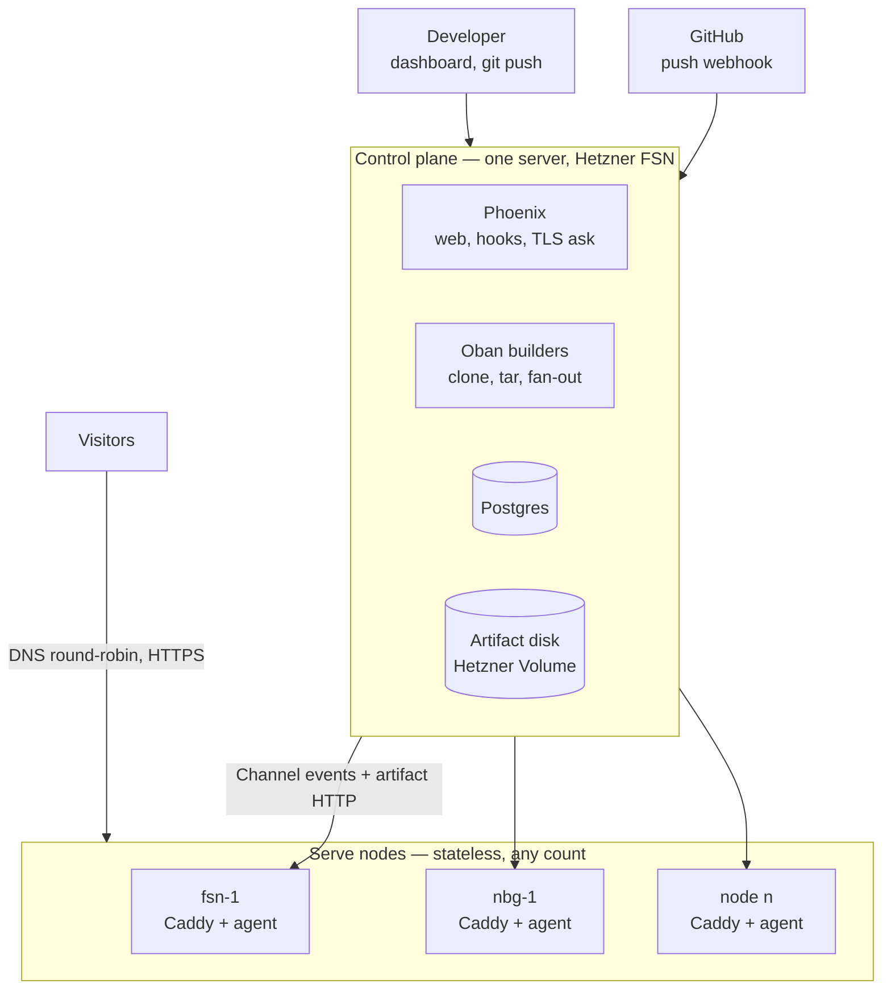

# Pagedock

European static site hosting. Push a repo, get a site, it stays in the EU.

## 1. Project definition

### What it is
A hosting service for static sites. A user connects a GitHub repository; every push deploys the site to a `*.pagedock.site` subdomain (later a custom domain) over HTTPS. All infrastructure, data and operations are inside the EU.

### Who it's for
Developers, agencies and small companies in Europe who want Netlify/Vercel-style push-to-deploy without their files, builds or account data leaving the EU. Secondary audience: anyone whose client or DPO asks "where is this hosted?"

### Why it exists
Netlify, Vercel and Cloudflare Pages serve from a global edge but keep origin, builds and account data in the US. The EU-native alternatives are either full PaaS (too much) or plain VPS (too little). Pagedock is the thin middle: git in, HTTPS out, nothing else to think about.

### Principles
- Boring infrastructure: Hetzner, Caddy, Postgres, Elixir. No managed cloud services.
- Nodes are disposable; the control plane is the only thing worth backing up.
- Ship the smallest thing that deploys a site; add features only when a real user asks.
- Say exactly what works and what doesn't on the landing page.

### MVP scope
**In:** account (register, login, logout, settings), public GitHub repos, static files only, auto subdomain with TLS, webhook push-to-deploy, deploy history and rollback, custom 404, multi-node serving.
**Out (planned):** custom domains, private repos via GitHub App, build steps (Astro/Hugo/Eleventy), preview deploys, redirects/headers, billing.
**Never (by integration instead):** analytics (Plausible/Umami snippet), "SEO" (auto `robots.txt`/`sitemap.xml`, Search Console DNS verification on the domains page).

### Domains
- `pagedock.eu` — product, dashboard, marketing.
- `pagedock.site` — user sites. Separate domain so user content never shares cookies or reputation with the product.

### Business
Sole proprietorship (JDG), Gdańsk, Poland. Free during beta; one paid plan later (more sites, custom domains) via Stripe.

## 2. Architecture

### Overview

### Components

**Control plane** (`pagedock` — Phoenix app, one server)
- Accounts, sites, deploys, nodes, domains. Dashboard in LiveView.
- GitHub webhook endpoint: `POST /hooks/github/:webhook_token`.
- Oban `:deploys` queue: shallow clone → take `publish_dir` → `tar + zstd` → write to artifact disk → insert `deploy` → broadcast to nodes.
- Artifact endpoint: `GET /artifacts/:site_id/:deploy_id` (node bearer token, `send_file`).
- Caddy on-demand TLS `ask` endpoint: `GET /caddy/ask?domain=` → 200 if the domain belongs to a site.
- Node registry over Phoenix Channels: presence, heartbeats, deploy events.
- Postgres also stores Caddy certificates (shared cert storage for all nodes).
- Artifacts on a Hetzner Volume; nightly `restic` backup to a Hetzner Storage Box. Retention: last 5 deploys per site.

**Serve node** (`pagedock_node` — small Elixir release + Caddy, N servers)
- Agent opens a Channel to the control plane with a node token; sends heartbeat (disk, load, synced sites) every 10 s.
- On `{deploy, site_id, deploy_id}`: download artifact, extract to `/srv/sites/<subdomain>/<deploy_id>/`, atomically flip `current` symlink, ack.
- On boot: request `(site, current_deploy)` list, pull everything (or lazily, see cache mode).
- LRU eviction of sites not requested in N days; the artifact disk is the source of truth.
- Caddy: one wildcard block for `*.pagedock.site`, `root /srv/sites/{labels.2}/current`; on local miss, `reverse_proxy` to the artifact endpoint. Custom domains via on-demand TLS with Postgres cert storage.
- Inbound: 80/443 only. Nodes never talk to each other.

**Traffic**
- `*.pagedock.site` A records (Hetzner DNS API) for every healthy node, round-robin. Control plane removes a node from DNS after missed heartbeats.
- Later: GeoDNS pools per region, Bunny.net (EU CDN) in front.

### Deploy flow
1. Push → GitHub webhook → `DeployWorker` enqueued.
2. Worker clones, packs `publish_dir`, stores `sites/<site>/<deploy>.tar.zst`, sets deploy `built`.
3. Broadcast to all connected nodes.
4. Each node pulls, extracts, flips symlink, acks → `node_deploys` row `synced`.
5. Deploy is `live` on first ack, `converged` when all healthy nodes ack. Dashboard shows per-node status.
6. Rollback = broadcast an older `deploy_id`.

### Data model
- `users` — from `phx.gen.auth`, plus `plan`, `sites_limit`.
- `sites` — `user_id, name, repo_url, branch, publish_dir, subdomain (unique), webhook_token, status`.
- `deploys` — `site_id, commit_sha, commit_message, status, log, size_bytes, sha256, started_at, finished_at`.
- `nodes` — `name, region, public_ip, token_hash, status, last_heartbeat_at, disk_free_bytes`.
- `node_deploys` — `node_id, deploy_id, status, synced_at`.
- `domains` (later) — `site_id, hostname, verified_at, cname_target`.

### Scaling notes
- Disk: nodes cache, artifact disk is truth. 10k sites × 20 MB ≈ 200 GB lives on one volume, not on every node.
- Bandwidth: 20 TB/month included per Hetzner node; per-site rate limits in Caddy.
- TLS: one wildcard cert shared; custom-domain certs stored centrally, issued on demand.
- Control plane: builders move to separate boxes when one is not enough; the web node never builds.
- DNS: round-robin to ~10 nodes, then regional pools.

### Stack
Elixir 1.17 / Phoenix 1.7 / LiveView, Oban, Postgres 16, Caddy 2 (with `caddy-dns/hetzner` or Cloudflare plugin and Postgres storage module), Tailwind, Hetzner Cloud + Volumes + DNS + Storage Box. Provisioning: `hcloud` CLI + cloud-init scripts. Deploy of the control plane via systemd release or Coolify.

## 3. Milestones
0. Foundations: Phoenix app, Tailwind config, landing page, one Hetzner box, Caddy wildcard block. 
1. Accounts: `phx.gen.auth`, settings page.
2. Deploy pipeline: schemas, `DeployWorker`, artifact disk + endpoint.
3. Node agent: Channel protocol, two nodes, DNS round-robin, heartbeats, admin "Servers" page.
4. Sites UI: list, create, detail with live deploy log, rollback, delete. → **MVP, get users.**
5. Account area polish (Sites / Account / Billing placeholder), usage per site.
6. Custom domains with on-demand TLS.
7. Billing (Stripe Checkout + Portal).
8. GitHub App (private repos), then build steps.